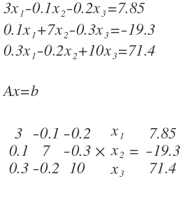

# LinearSolvers.jl


## Introduction.
This package is being designed among others to provide Petroleum Engineering tools in a modern programming language. This package is part of the project 7G which  proposes to make basic but powerful engineering software packages that cover the main topics of the Oil and Gas development phases which could be applied to any case study by suitable engineers.

There are five topics in which the project is going to be focused on:

<br>-Geoscience*
<br>-Reservoir (Current Package)
<br>-Production
<br>-Economics
<br>-Integration

<br> The package will always be in permanent development and open to suggestions to enhance the program. As the code has been written so far by a code enthusiastic Petroleum Engineer I hope to learn as much as possible to get better and useful programs.

## LinearSolvers.jl Description
LinearSolvers.jl is a package that provides some Linear Algebra Algorithms that solve  linear systems of equations (with the form Ax=b). This kind of equations are important on the Petroleum Engineering field specially on Reservoir Simulation.

The algorithms written in this packages are described by Chapra(1)


## Gauss Elimination Solvers  

  - Naive Gauss Elimination (Without Pivoting)
  - Pivot Gauss Elimination

### Example

```julia
using LinearSolvers
using LinearAlgebra
```

Given a Linear system of Equations whcih can be represented in a matrix form
  <br>

```NaiveGauss(A::Array,B::Vector)```

```julia
A=[3 -0.1 -0.2;0.1 7 -0.3; 0.3 -0.2 10]
B=[7.85, -19.3, 71.4]
x=NaiveGauss(A,B)

3-element Array{Float64,1}:
  3.0              
 -2.5              
  7.000000000000002
```
```PivotGauss(A::Array,B::Vector)```

```julia
A=[2. -6. -1.; -1. -1. 7.; -8. 1. -2.]
B=[-38.,-34.,-20.]
x=PivotGauss(A,B)

3-element Array{Float64,1}:
  4.29971181556196
  8.276657060518732
 -3.060518731988473
```

## LU Decomposition

You can perform LU decomposition to a matrix


```DolittleLU(A::Array; pivot=true)```

LU Decomposition without Pivoting

```julia
A=[3 -0.1 -0.2;0.1 7 -0.3;0.3 0.2 10]
L,U, P, p=DolittleLU(A, pivot=false)

display(P)  # Display Permutation Matrix
display(L)  # Lower Triangular Matrix
display(U)  # Upper Triangular Matrix
display(L*U)

3×3 Array{Float64,2}:
 1.0  0.0  0.0
 0.0  1.0  0.0
 0.0  0.0  1.0
3×3 LowerTriangular{Float64,Array{Float64,2}}:
 1.0         ⋅          ⋅
 0.0333333  1.0         ⋅
 0.1        0.0299857  1.0
3×3 UpperTriangular{Float64,Array{Float64,2}}:
 3.0  -0.1      -0.2     
  ⋅    7.00333  -0.293333
  ⋅     ⋅       10.0288  
3×3 Array{Float64,2}:
 3.0  -0.1  -0.2
 0.1   7.0  -0.3
 0.3   0.2  10.0
```

LU Decomposition with Pivoting

```julia
A=[2. -6. -1.;-3. -1. 7.;-8. 1. -2.]
a=A
L,U, P, p=DolittleLU(A)

display(P)
display(L)
display(U)
display(L*U)
display(P*A)

3×3 Array{Float64,2}:
 0.0  0.0  1.0
 1.0  0.0  0.0
 0.0  1.0  0.0
3×3 LowerTriangular{Float64,Array{Float64,2}}:
  1.0     ⋅        ⋅
 -0.25   1.0       ⋅
  0.375  0.23913  1.0
3×3 UpperTriangular{Float64,Array{Float64,2}}:
 -8.0   1.0   -2.0   
   ⋅   -5.75  -1.5   
   ⋅     ⋅     8.1087
3×3 Array{Float64,2}:
 -8.0   1.0  -2.0
  2.0  -6.0  -1.0
 -3.0  -1.0   7.0

 3×3 Array{Float64,2}:
 -8.0   1.0  -2.0
  2.0  -6.0  -1.0
 -3.0  -1.0   7.0
```

The L and U Matrix can be used to solve a linear systems of equations by making Forward an then backward substitution.

```julia
A=[2. -6. -1.;-3. -1. 7.;-8. 1. -2.]
B=[-38,-34,-20]
x=LUSolve(A,B)

3-element Array{Float64,1}:
  4.0
  8.0
 -2.0
```

### Matrix Inverse by LU decomposition

```julia
A=[15. -3. 1.;-3. 18. -6.;-4. -2. 12.]
N, P=InverseLU(A)
display(N)

3×3 Array{Float64,2}:
 0.0689655  0.0114943  0.0      
 0.020284   0.0622042  0.0294118
 0.0263692  0.0141988  0.0882353
```

### Solve System of Linear Equation by Inverse matrix
```julia
A=[15. -3. 1.;-3. 18. -6.;-4. -2. 12.]
B=[3300., 1200., 2400.]
x=InverseLUSolve(A,B)

3-element Array{Float64,1}:
 241.3793103448276
 212.17038539553752
 315.82150101419876
```
### Tridiagonal matrix

You can decompose a tridiagonal matrix in a more efficient way by applying the Thomas Algorithms

```julia
A=[2.04 -1. 0 0;-1 2.04 -1 0; 0 -1 2.04 -1; 0 0 -1 2.04]
L,U=ThomasLU(A)
display(L)
display(U)
display(L*U)

4×4 Tridiagonal{Float64,Array{Float64,1}}:
  1.0        0.0         ⋅         ⋅
 -0.490196   1.0        0.0        ⋅
   ⋅        -0.645243   1.0       0.0
   ⋅          ⋅        -0.716971  1.0
4×4 Tridiagonal{Float64,Array{Float64,1}}:
 2.04  -1.0       ⋅         ⋅     
 0.0    1.5498  -1.0        ⋅     
  ⋅     0.0      1.39476  -1.0    
  ⋅      ⋅       0.0       1.32303
4×4 Array{Float64,2}:
  2.04  -1.0    0.0    0.0
 -1.0    2.04  -1.0    0.0
  0.0   -1.0    2.04  -1.0
  0.0    0.0   -1.0    2.04
```

You can solve by LU decomposition a tridiagonal system of Equations

```julia
A=[2.04 -1. 0 0;-1 2.04 -1 0; 0 -1 2.04 -1; 0 0 -1 2.04]
B=[40.8,0.8,0.8,200.8]
x=ThomasLUSolve(A,B)

4-element Array{Float64,1}:
  65.96983436677662
  93.77846210822433
 124.538228334001  
 159.47952369313774
 ```

## Crout Decomposition

You can Decompose a matrix using a Crout Algorithms

```
A=[3 -0.1 -0.2;0.1 7 -0.3;0.3 0.2 10]
L,U=CroutLU(A)

display(L)
display(U)
display(L*U)

3×3 Array{Float64,2}:
 3.0  0.0       0.0   
 0.1  7.00333   0.0   
 0.3  0.21     10.0288
3×3 Array{Float64,2}:
 1.0  -0.0333333  -0.0666667
 0.0   1.0        -0.0418848
 0.0   0.0         1.0      
3×3 Array{Float64,2}:
 3.0  -0.1  -0.2
 0.1   7.0  -0.3
 0.3   0.2  10.0

```

## Cholesky decomposition

You can decompose a symmetric matrix by applying the Cholesky algorithm

```julia
A=[6. 15. 55.; 15. 55. 225.; 55. 225. 979.]
L=CholeskyL(A)
display(L)
display(L*L')

3×3 Array{Float64,2}:
  2.44949   0.0     0.0   
  6.12372   4.1833  0.0   
 22.4537   20.9165  6.1101
3×3 Array{Float64,2}:
  6.0   15.0   55.0
 15.0   55.0  225.0
 55.0  225.0  979.0
```


## Iterative Linear Solvers

### Gauss-Seidel Method Implementation

Equation can be rearrange to ensure convergence by setting the diagonal element greater than the off-diagonal element of each row

```GaussSeidelSolve(A::Any,B::Vector; ϵ=0.05, MaxItr=30, λ=1)```

```julia
A=[2. -6. -1.;-3. -1. 7.;-8. 1. -2.]
P=[0 0 1;1 0 0; 0 1 0]
B=[-38.,-34.,-20.]
X=GaussSeidelSolve(P*A,P*B)

Iteration 1 Error 100.0 %
Iteration 2 Error 38.82010196649672 %
Iteration 3 Error 2.9227911545754854 %
3-element Array{Float64,1}:
  4.004659155328798
  7.991679657974301
 -1.9991918394341863
```
# References

Chapra, S. C., & Canale, R. P. (2010). Numerical methods for engineers. McGraw-Hill Higher Education.
